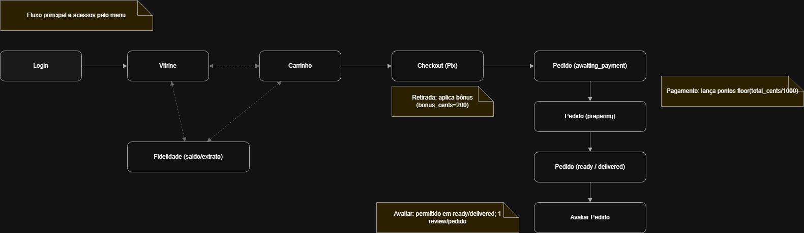

# Mapa de Navegação — Cupcakes (MVP)

> **Imagem (export):** abaixo

---

## Nós e fluxos principais

**Fluxo principal (compra):**
1. `Login` → `Vitrine` → `Carrinho` → `Checkout (Pix)` → `Pedido (awaiting_payment)`
2. Transições de status: `Pedido (awaiting_payment)` → `Pedido (preparing)` → `Pedido (ready / delivered)` → `Avaliar Pedido`

**Acessos via menu (bidirecionais):**
- `Vitrine` ↔ `Carrinho`
- `Vitrine` ↔ `Fidelidade (saldo/extrato)`
- `Carrinho` ↔ `Fidelidade (saldo/extrato)`

---

## Regras/Notas do Fluxo
- **Retirada** no checkout aplica **bônus** (`bonus_cents = 200`).
- **Pagamento** do pedido lança pontos: `points = floor(total_cents / 1000)`.
- **Avaliação** permitida apenas em `ready` ou `delivered`; **1 review por pedido**.

---

## Como editar/exportar
1. Abra `mapa-navegacao.drawio` no diagrams.net.  
2. Ajuste posições/cores se necessário.  
3. **File → Export as → PNG** → salve como `docs/ihc/fluxos/mapa-navegacao.png`.  
4. Verifique aqui no GitHub se a imagem aparece corretamente.

