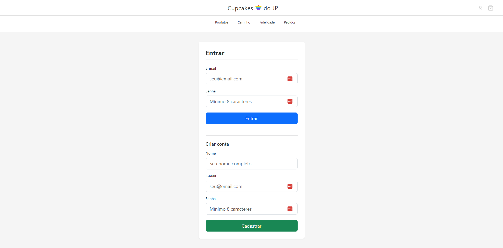
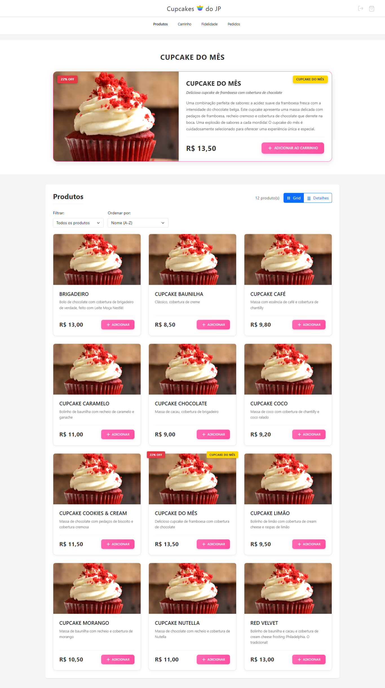
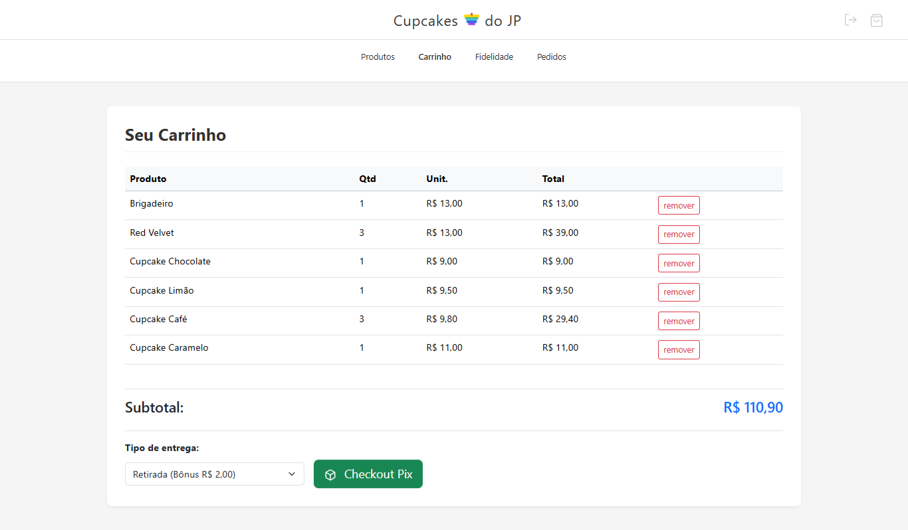
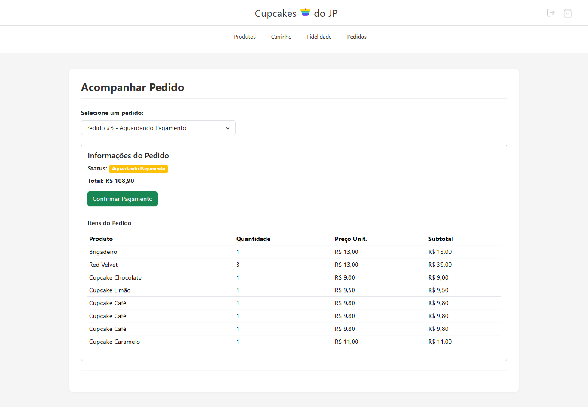
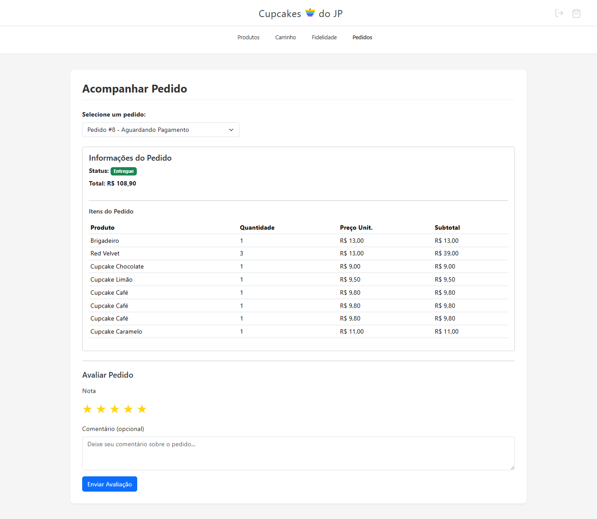
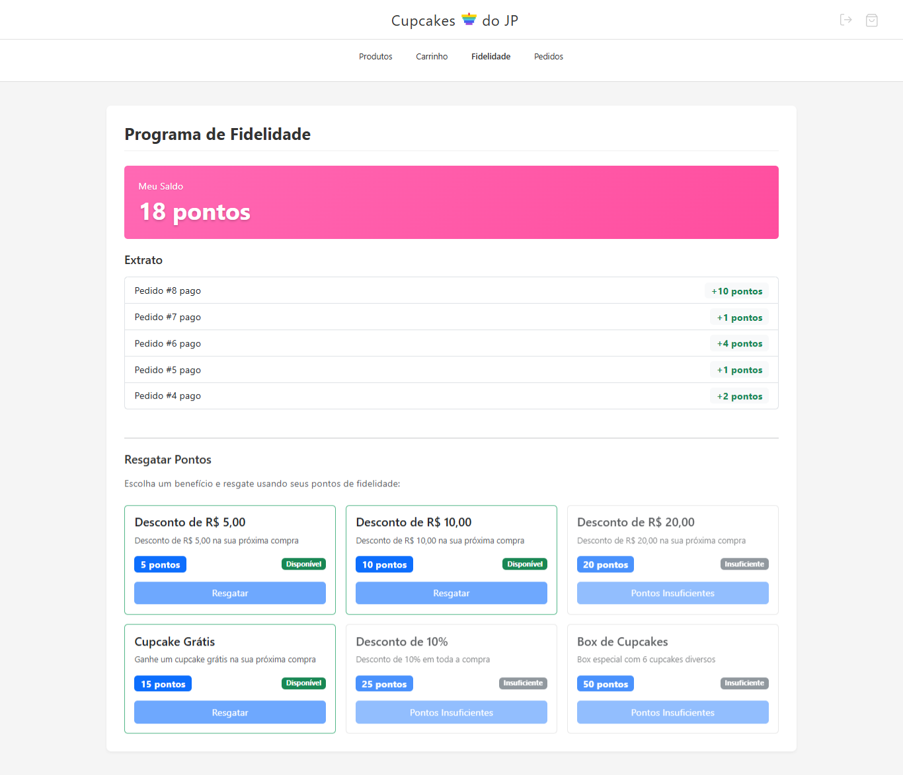

# Protótipos / Prints das Telas (MVP)

> Telas reais do MVP rodando localmente.

   
  <em>Login</em>

   
  <em>Vitrine</em>

   
  <em>Carrinho</em>

   
  <em>Checkout Pix — retirada com bônus</em>

   
  <em>Pedido — após pagamento (status: preparing)</em>

   
  <em>Fidelidade — saldo e extrato</em>

---

## Observações de IHC aplicadas
- **Clareza:** rótulos diretos e feedbacks objetivos.
- **Consistência:** mesma barra de topo e padrões de botão.
- **Simplicidade:** fluxo linear compra → pagamento → status → avaliação.
- **Feedback:** estados e mensagens de erro previstas (ver `docs/ihc/mensagens-erro.md`).
