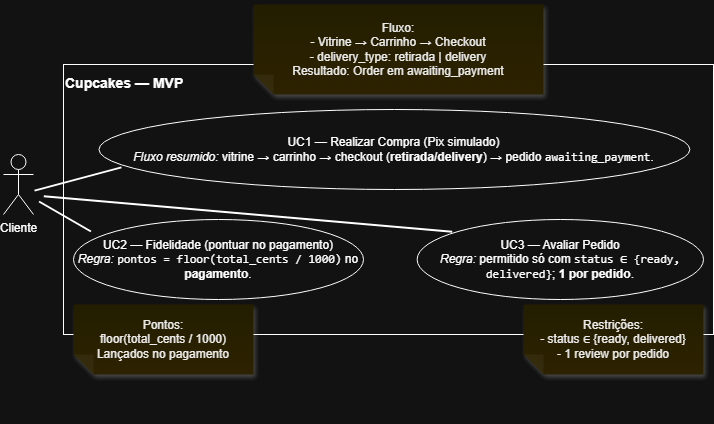

# Casos de Uso — App Loja de Cupcakes

> **Delta ES I → ES II (Casos de Uso)**
> **Resumo:** focamos em 3 UCs nucleares do MVP; fluxos e regras batem 1:1 com a implementação.

### Escopo consolidado (mantidos/ajustados)
- **UC1 — Realizar Compra (Pix simulado):** vitrine → carrinho → checkout (`delivery_type`) → `Order(awaiting_payment)` → pagar (simulado) → avançar status.
- **UC2 — Fidelidade (acumular pontos):** pontos lançados **no pagamento** do pedido: `floor(total_cents/1000)`.
- **UC3 — Avaliação pós-compra:** 1 avaliação por pedido, permitida apenas em `ready` ou `delivered`.

### Regras incorporadas no fluxo
- **Bônus de retirada:** aplicado no checkout (`bonus_cents` = 200).
- **Transições válidas:** `awaiting_payment → preparing → ready → delivered | canceled`.
- **Bloqueios:** segunda avaliação do mesmo pedido retorna erro (409).

### Itens postergados / fora do MVP
- Resgate/uso de pontos em compra futura.
- Integração com gateway Pix real / logística real.
- Telas/funcionalidades administrativas.

> (Quando o PNG estiver pronto, insira aqui:)
> **Figura 2 — Diagrama de Casos de Uso (UC1, UC2, UC3)**
> 

## UC1 — Realizar Compra
**Atores:** Cliente  
**Pré-condições:** Usuário autenticado; catálogo disponível.  
**Fluxo Principal:**
1. Cliente navega na vitrine e adiciona produtos ao carrinho.
2. Cliente acessa o carrinho, escolhe `delivery_type` e prossegue ao checkout Pix (simulado).
3. Sistema cria `Order(status='awaiting_payment')`, calcula `bonus_cents` (se retirada) e `total_cents`.
4. Cliente confirma pagamento (simulado) → Sistema muda `status='preparing'` e registra `paid_at`.
5. (Opcional) Sistema/Usuário avança status para `ready` e `delivered`.

**Pós-condições:** Pedido criado, valores calculados, status atualizado.

## UC2 — Acumular Pontos de Fidelidade
**Atores:** Cliente  
**Gatilho:** Confirmação de pagamento do pedido.  
**Fluxo Principal:**
1. Ao confirmar pagamento de um `Order`, sistema calcula pontos: `floor(total_cents/1000)`.
2. Sistema lança em `LoyaltyLedger(user_id, points_delta>0, reason)`.
3. Cliente consulta saldo e extrato em `/loyalty/summary`.

## UC3 — Avaliar Pedido
**Atores:** Cliente  
**Pré-condições:** `Order.status in ('ready','delivered')` e sem review prévia.  
**Fluxo Principal:**
1. Cliente informa `rating (1..5)` e `comment` (opcional).
2. Sistema cria `Review(order_id, rating, comment)`.
3. Sistema bloqueia novas avaliações do mesmo pedido.

**Fluxos Alternativos (gerais):**
- UC1.FA1 — Carrinho vazio no checkout: sistema retorna erro 400.  
- UC1.FA2 — Pedido não está aguardando pagamento: erro 400 na confirmação.  
- UC3.FA1 — Pedido já avaliado: erro 409.
