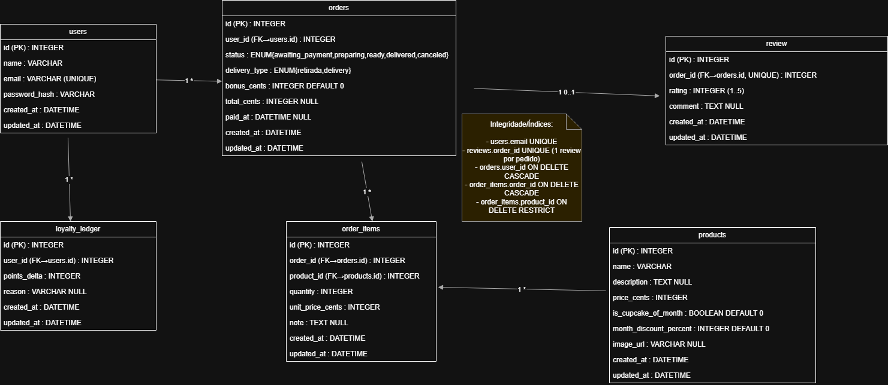

# DER — App Loja de Cupcakes

> (Quando o PNG estiver pronto, insira aqui:)
> **Figura 3 — Diagrama Entidade-Relacionamento**
> 

## Tabelas, Chaves e Cardinalidades

**users (PK: id)**  
- 1 **—N** orders.user_id  
- 1 **—N** loyalty_ledger.user_id

**products (PK: id)**  
- 1 **—N** order_items.product_id

**orders (PK: id, FK: user_id→users.id)**
- 1 **—N** order_items.order_id  
- 1 **—0..1** reviews.order_id

**order_items (PK: id, FK: order_id→orders.id, FK: product_id→products.id)**

**loyalty_ledger (PK: id, FK: user_id→users.id)**

**reviews (PK: id, FK: order_id→orders.id)**

## Regras de Integridade
- `orders.user_id` **CASCADE** em delete/update.  
- `order_items.order_id` **CASCADE**; `product_id` **RESTRICT**.  
- `reviews.order_id` **CASCADE**.  
- `loyalty_ledger.user_id` **CASCADE**.

## Observações
- `orders.status` e `orders.delivery_type` são ENUMs.  
- `orders.total_cents` e `orders.paid_at` definidos no checkout/pagamento.
